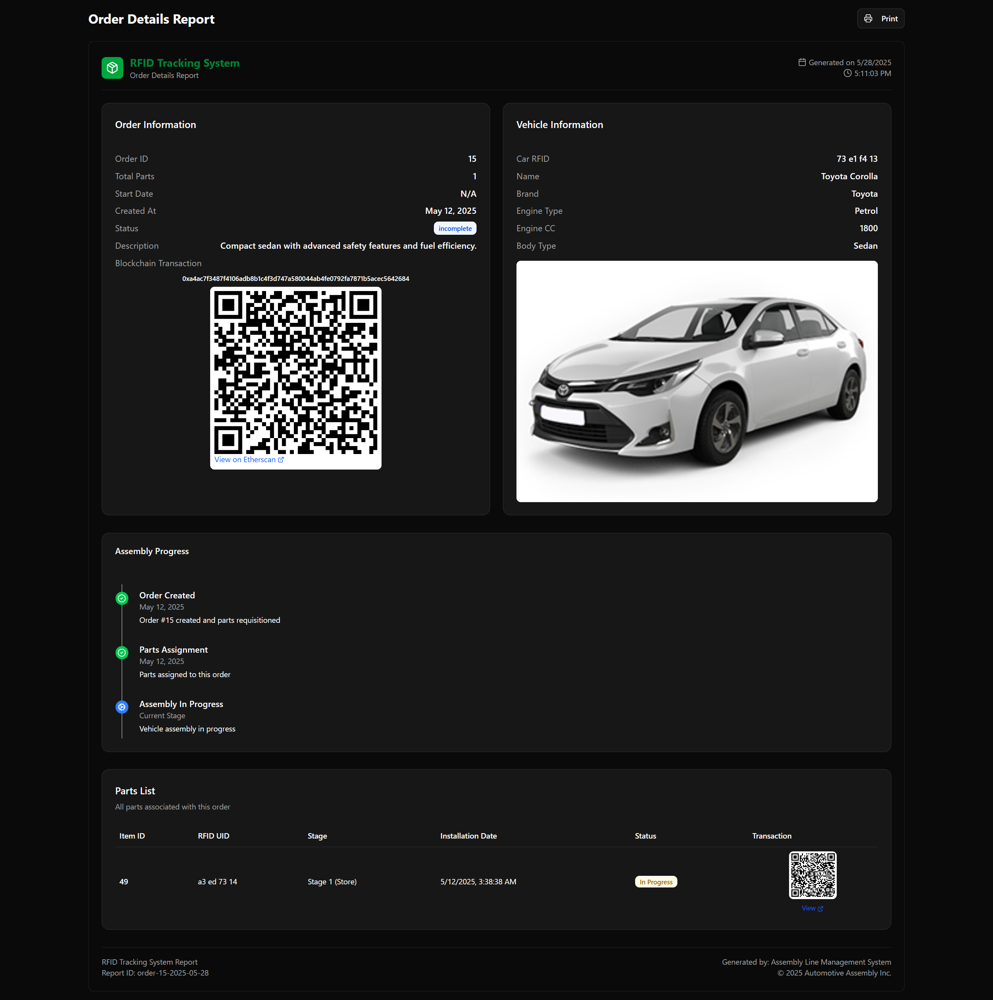

# TrustChain: Automotive Supply Chain Integrity Platform

## Overview
TrustChain is a comprehensive solution for tracking and verifying automotive parts throughout their lifecycle in repair and insurance claims. The platform combines ESP32-based RFID scanning with blockchain technology to ensure authenticity and prevent fraud in the automotive supply chain.

## Architecture


## Screenshots

### Dashboard

*Main dashboard showing supply chain overview and key metrics*

### Front Page

*Landing Page*

### Car Order Management

*Interface for managing car parts orders and tracking*

### System Logs

*Detailed logging system for tracking all platform activities*

### About Us

*Information about the TrustChain platform and team*

## Tech Stack
- **Frontend**: React.js with Tailwind CSS
- **Backend**: Node.js with Express
- **Blockchain**: Smart Contracts (Solidity)
- **Hardware**: ESP32 with RFID scanning capabilities
- **Database**: Supabase

## Prerequisites
- Node.js (v14 or higher)
- Arduino IDE
- ESP32 board
- CP210x USB-to-UART Bridge driver for Hardware Installation
- MetaMask or compatible Web3 wallet

###  Full Stack Setup:
   ```bash
   # Frontend
   cd frontend
   npm install

   # Backend
   cd backend
   npm install
   ```

### Start the application:
   ```bash
   # Frontend
   cd frontend
   npm run both
   ```
